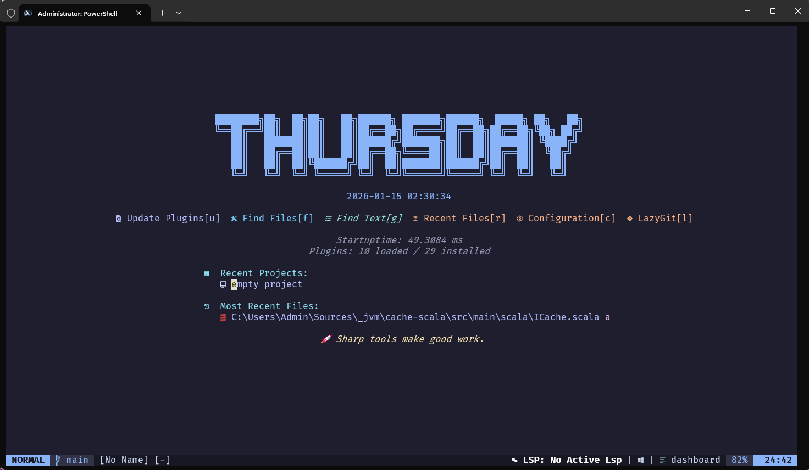
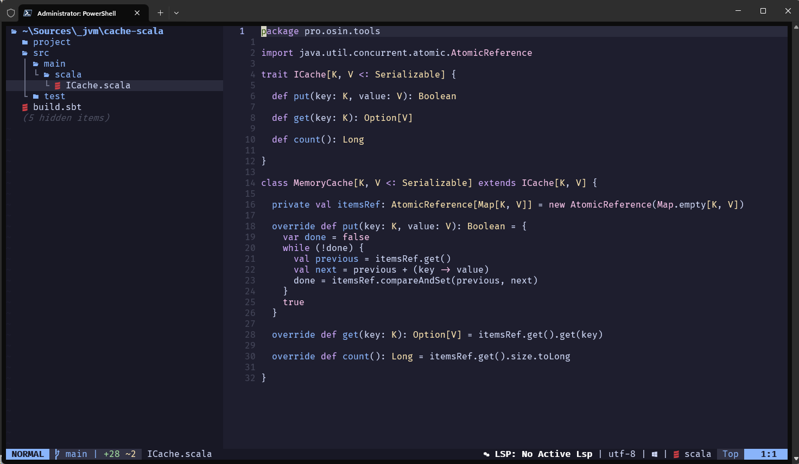
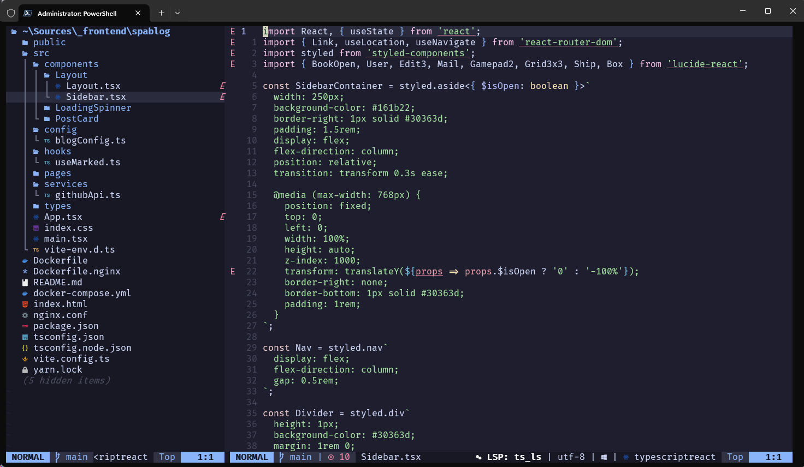
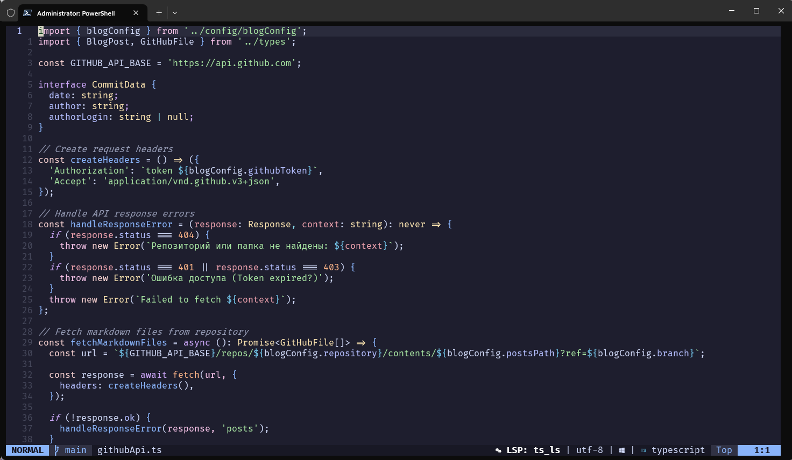

# Neovim Configuration

Modular Neovim setup with Lazy.nvim. Designed for Lua, Python, JS/TS, Vue, HTML, CSS, SQL, Scala, Rust, C#, and Clojure development.

## Features
- Modular Lua configuration with separate `options`, `keymaps`, and plugin specs.
- Lazy.nvim plugin manager with lockfile-pinned versions.
- LSP via Mason + nvim-lspconfig (configured for `lua_ls`, `ts_ls`, `html`, `cssls`, `sqlls`, `pyright`; Volar handler included for Vue).
- Completion with nvim-cmp + LuaSnip + friendly-snippets.
- Treesitter highlighting and indentation for common languages.
- UI stack: Catppuccin theme, Lualine statusline (LSP status), Dashboard, Noice notifications.
- File explorer, fuzzy finder, floating terminal, and LazyGit integration.
- Editor helpers: autopairs, autotag, and quick commenting.
- Color highlighting for HEX/RGB/HSL values.

## Screenshots

## Keymaps
Leader key: `Space`

### General
- `Esc` — clear search highlight
- `Ctrl+s` — save file (normal/insert/visual/select)
- `Ctrl+h/j/k/l` — window navigation

### File Explorer (Neo-tree)
- `Leader+e` — toggle file explorer

### Fuzzy Finder (Telescope)
- `Leader+ff` — find files
- `Leader+fg` — live grep
- `Leader+fb` — buffers
- `Leader+fh` — help tags
- `Leader+fk` — keymaps

### LSP (on attach)
- `gd` — go to definition
- `gD` — go to declaration
- `gr` — references
- `gi` — go to implementation
- `K` — hover documentation
- `Ctrl+k` (insert) — signature help
- `Leader+cd` — documentation (popup)
- `Leader+cr` — rename
- `Leader+ca` — code action
- `Leader+cf` — format document

### Comments (Comment.nvim)
- `gcc` — toggle line comment
- `gc` — toggle block comment (normal/visual)
- `gb` — toggle block comment (normal/visual)

### Git
- `Leader+gg` — open LazyGit
- `Leader+gb` — blame line (popup)
- `Leader+gB` — toggle line blame (virtual text)

### Terminal (ToggleTerm)
- `Ctrl+\` — toggle terminal
- `Leader+tf` — open floating terminal

### Dashboard shortcuts (on start screen)
- `u` — update plugins
- `f` — find files
- `g` — live grep
- `r` — recent files
- `c` — edit config
- `l` — LazyGit

## Plugins and versions (lazy-lock.json)
Format: `branch@commit`

- `folke/lazy.nvim` — `main@306a05526ada86a7b30af95c5cc81ffba93fef97`
- `catppuccin/nvim` — `main@beaf41a30c26fd7d6c386d383155cbd65dd554cd`
- `nvim-lualine/lualine.nvim` — `master@47f91c416daef12db467145e16bed5bbfe00add8`
- `nvimdev/dashboard-nvim` — `master@0775e567b6c0be96d01a61795f7b64c1758262f6`
- `folke/noice.nvim` — `main@7bfd942445fb63089b59f97ca487d605e715f155`
- `rcarriga/nvim-notify` — `master@8701bece920b38ea289b457f902e2ad184131a5d`
- `MunifTanjim/nui.nvim` — `main@de740991c12411b663994b2860f1a4fd0937c130`
- `nvim-tree/nvim-web-devicons` — `master@803353450c374192393f5387b6a0176d0972b848`
- `nvim-neo-tree/neo-tree.nvim` — `v3.x@f3df514fff2bdd4318127c40470984137f87b62e`
- `nvim-telescope/telescope.nvim` — `0.1.x@a0bbec21143c7bc5f8bb02e0005fa0b982edc026`
- `nvim-lua/plenary.nvim` — `master@b9fd5226c2f76c951fc8ed5923d85e4de065e509`
- `nvim-treesitter/nvim-treesitter` — `main@5a7e5638e7d220575b1c22c8a2e099b52231886e`
- `williamboman/mason.nvim` — `main@44d1e90e1f66e077268191e3ee9d2ac97cc18e65`
- `williamboman/mason-lspconfig.nvim` — `main@80c0130c5f16b551865a69e832f1feadeedb5fbe`
- `neovim/nvim-lspconfig` — `master@92ee7d42320edfbb81f3cad851314ab197fa324a`
- `hrsh7th/nvim-cmp` — `main@85bbfad83f804f11688d1ab9486b459e699292d6`
- `hrsh7th/cmp-buffer` — `main@b74fab3656eea9de20a9b8116afa3cfc4ec09657`
- `hrsh7th/cmp-path` — `main@c642487086dbd9a93160e1679a1327be111cbc25`
- `hrsh7th/cmp-nvim-lsp` — `main@cbc7b02bb99fae35cb42f514762b89b5126651ef`
- `hrsh7th/cmp-nvim-lsp-signature-help` — `main@fd3e882e56956675c620898bf1ffcf4fcbe7ec84`
- `L3MON4D3/LuaSnip` — `master@3732756842a2f7e0e76a7b0487e9692072857277`
- `saadparwaiz1/cmp_luasnip` — `master@98d9cb5c2f38532bd9bdb481067b20fea8f32e90`
- `rafamadriz/friendly-snippets` — `main@572f5660cf05f8cd8834e096d7b4c921ba18e175`
- `windwp/nvim-autopairs` — `master@c2a0dd0d931d0fb07665e1fedb1ea688da3b80b4`
- `windwp/nvim-ts-autotag` — `main@c4ca798ab95b316a768d51eaaaee48f64a4a46bc`
- `numToStr/Comment.nvim` — `master@e30b7f2008e52442154b66f7c519bfd2f1e32acb`
- `kdheepak/lazygit.nvim` — `main@a04ad0dbc725134edbee3a5eea29290976695357`
- `akinsho/toggleterm.nvim` — `main@50ea089fc548917cc3cc16b46a8211833b9e3c7c`
- `folke/which-key.nvim` — `main@3aab2147e74890957785941f0c1ad87d0a44c15a`

## License
MIT — see `LICENSE`.
